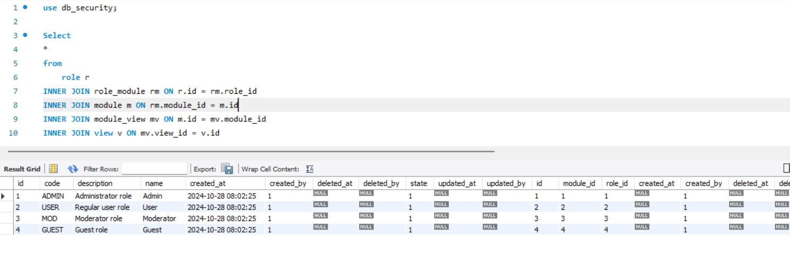

# Se requiere crear una consulta para:
    Obtener de manera ordenada la lista de vistas y modulos a los que tiene acceso un rol en estado activo. 
    role[name=> rol, route => ruta]
    module[name=> modulo, route => paquete]

```sql

Select
*
from
	role r
INNER JOIN role_module rm ON r.id = rm.role_id
INNER JOIN module m ON rm.module_id = m.id
INNER JOIN module_view mv ON m.id = mv.module_id
INNER JOIN view v ON mv.view_id = v.id
```

# Resultado



